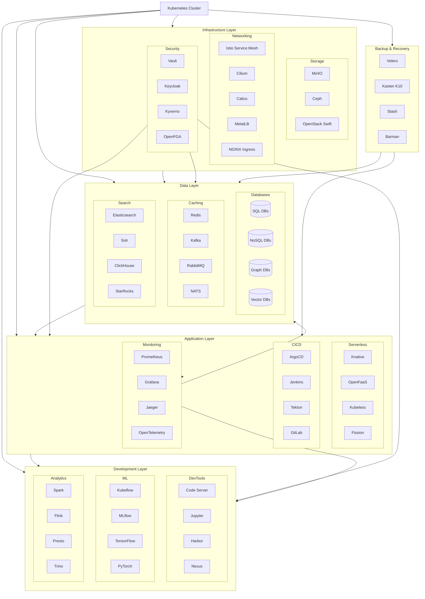
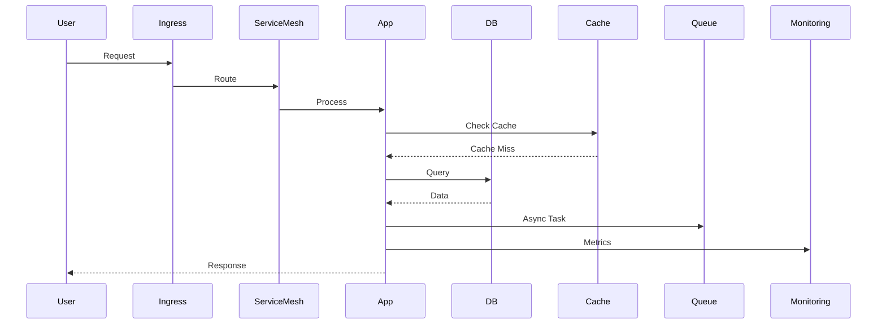
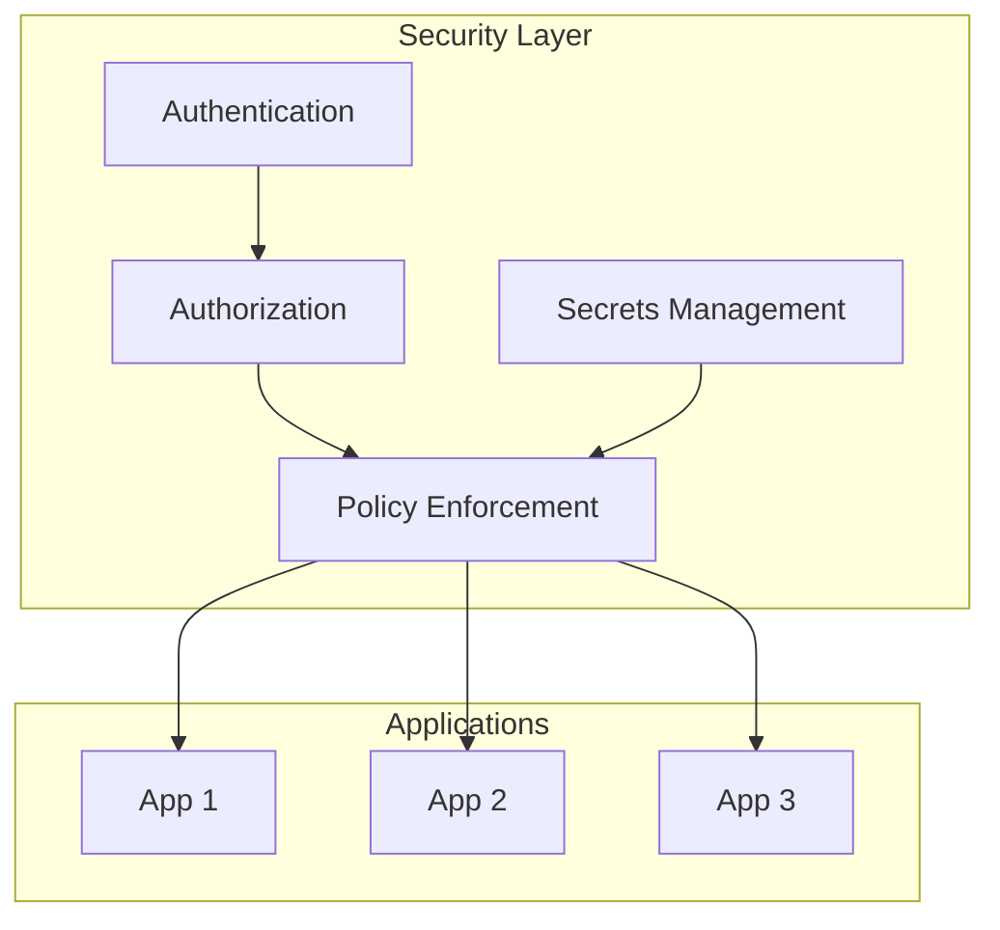
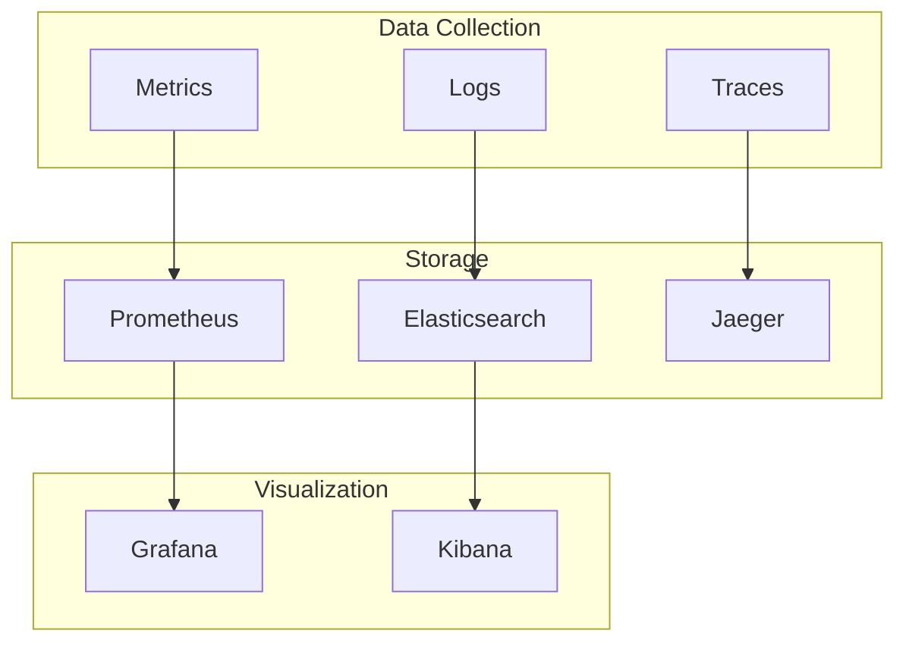
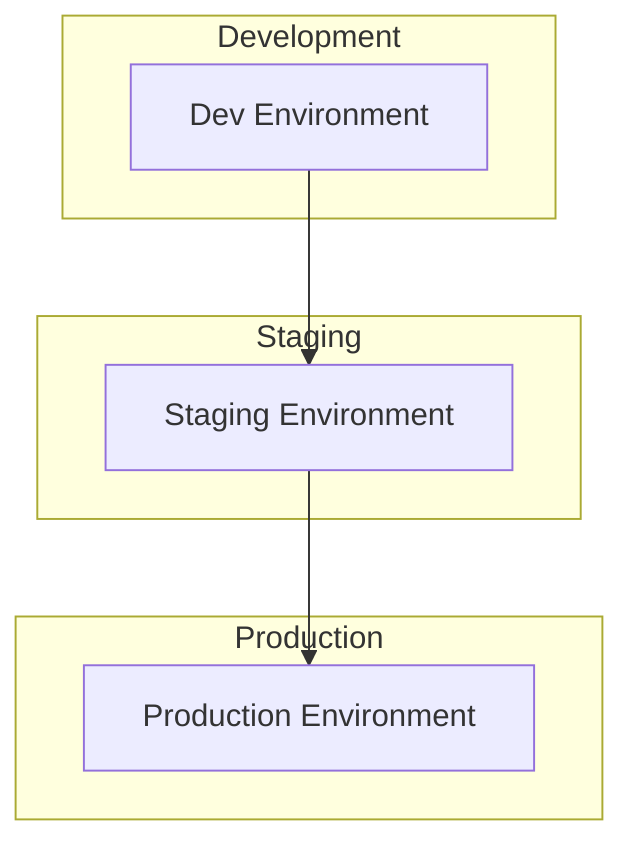
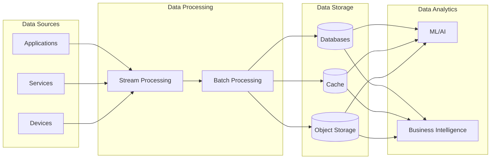

# Homelab System Design

## System Architecture Overview

## Component Details

### 1. Infrastructure Layer

#### Storage Layer
- **MinIO**: Object storage system
- **Ceph**: Distributed storage system
- **OpenStack Swift**: Object storage system

#### Network Layer
- **Istio**: Service mesh
- **Cilium**: Container networking
- **Calico**: Network policy
- **Flannel**: Container networking
- **MetalLB**: Load balancer
- **HAProxy**: Load balancer
- **Envoy**: Edge proxy
- **Kong**: API gateway
- **Traefik**: Edge router
- **NGINX Ingress**: Ingress controller
- **Ambassador**: API gateway
- **Linkerd**: Service mesh

### 2. Data Layer

#### Databases
- **PostgreSQL**: Relational database
- **MySQL**: Relational database
- **MongoDB**: Document database
- **Neo4j**: Graph database
- **Redis**: Key-value store
- **Elasticsearch**: Search engine
- **RabbitMQ**: Message broker
- **Dgraph**: Graph database
- **Qdrant**: Vector database
- **Solr**: Search platform
- **TiDB**: Distributed SQL database
- **PlanetScale Vitess**: MySQL scaling solution

#### Caching
- **Redis**: In-memory data store
- **Memcached**: Distributed caching system

#### Message Queues
- **RabbitMQ**: Message broker
- **Kafka**: Distributed streaming platform
- **NATS**: Messaging system

#### Search Engines
- **Elasticsearch**: Search and analytics engine
- **Solr**: Enterprise search platform

### 3. Application Layer

#### Serverless Functions
- **Knative**: Kubernetes-based serverless platform
- **OpenFaaS**: Function as a Service
- **Kubeless**: Kubernetes-native serverless framework
- **Fission**: Serverless functions for Kubernetes

#### CI/CD Pipeline
- **Jenkins**: Automation server
- **GitLab**: DevOps platform
- **GitLab CI**: CI/CD platform
- **Tekton**: Cloud-native CI/CD
- **Drone**: CI/CD platform
- **GitHub Actions Runner**: CI/CD runner
- **ArgoCD**: GitOps tool

#### Monitoring Stack
- **Prometheus**: Monitoring system
- **Grafana**: Visualization platform
- **Elasticsearch**: Log storage
- **Kibana**: Log visualization
- **Logstash**: Log processing
- **Fluentd**: Log collector
- **Fluent-bit**: Log processor
- **Jaeger**: Distributed tracing
- **Zipkin**: Distributed tracing
- **OpenTelemetry**: Observability framework
- **Datadog**: Monitoring platform
- **New Relic**: APM platform

#### Security Services
- **OpenFGA**: Authorization system
- **Kyverno**: Policy engine
- **Vault**: Secrets management
- **Keycloak**: Identity management
- **OAuth2 Proxy**: Authentication proxy
- **Dex**: Identity service
- **OpenLDAP**: Directory service

### 4. Development Layer

#### Development Tools
- **Code Server**: Web-based IDE
- **Jupyter**: Interactive computing
- **Gitea**: Git service
- **Nexus**: Artifact repository
- **Harbor**: Container registry
- **SonarQube**: Code quality
- **Baserow**: Database platform

#### ML/AI Tools
- **Kubeflow**: ML toolkit
- **MLflow**: ML lifecycle
- **TensorFlow Serving**: ML serving
- **PyTorch Serving**: ML serving

#### Analytics Tools
- **Spark**: Data processing
- **Flink**: Stream processing
- **Presto**: SQL query engine
- **Trino**: SQL query engine
- **ClickHouse**: Column-oriented DBMS
- **QuestDB**: Time series database
- **StarRocks**: OLAP database
- **Druid**: Analytics database
- **Doris**: OLAP database
- **Memgraph**: Graph database
- **AKHQ**: Kafka UI

#### Cloud Emulators
- **LocalStack**: AWS emulator
- **Azurite**: Azure emulator
- **GCP Emulators**: Google Cloud emulators

### 5. Backup and Recovery
- **Velero**: Backup and restore
- **Kasten K10**: Data management
- **Stash**: Backup operator
- **Percona XtraBackup**: Database backup
- **Barman**: PostgreSQL backup

## System Interactions

## Security Architecture

## Monitoring Architecture

## Deployment Architecture

## Data Flow Architecture

